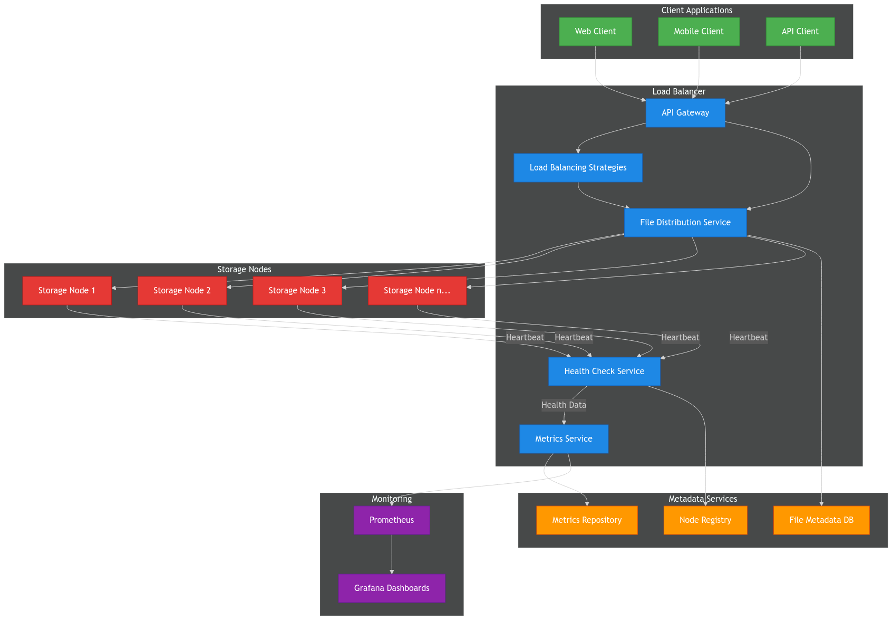

# DistributedStorage


A robust and scalable Java distributed storage system with an intelligent load balancer for managing file storage across multiple nodes.

## Overview

DistributedStorage is a high-performance distributed file storage system designed for reliability, scalability, and fault tolerance. The system dynamically distributes files across multiple storage nodes using advanced load balancing strategies while providing a unified API for file operations.

### Key Features

- **Dynamic Load Balancing**: Multiple algorithms including round-robin, least-connection, and weighted strategies
- **Automatic Health Monitoring**: Continuous health checks with automatic failover
- **Real-time Metrics**: Comprehensive performance tracking for system and nodes
- **Horizontal Scalability**: Seamlessly add or remove storage nodes without downtime
- **File Redundancy**: Optional file replication for enhanced data durability
- **RESTful API**: Simple yet powerful API for file operations
- **Containerization Support**: Designed for Docker/Kubernetes environments

## Architecture

DistributedStorage consists of three main components:

1. **Load Balancer**: Receives client requests and intelligently routes them to appropriate storage nodes
2. **Storage Nodes**: Independent servers that store and manage files
3. **Metadata Service**: Tracks file locations and system configuration

<div align="center">
  
</div>

## Getting Started

### Prerequisites

- Java 17 or higher
- MySQL 8.0 or higher
- Maven 3.6 or higher
- Docker (optional, for containerized deployment)

### Installation

#### Option 1: Manual Setup

1. Clone the repository:
   ```bash
   git clone https://github.com/kenzycodex/distributed-storage.git
   cd distributed-storage
   ```

2. Configure the database:
   ```bash
   # Create MySQL database
   mysql -u root -p
   CREATE DATABASE loadbalancer;
   CREATE USER 'loadbalancer'@'localhost' IDENTIFIED BY 'loadbalancer';
   GRANT ALL PRIVILEGES ON loadbalancer.* TO 'loadbalancer'@'localhost';
   FLUSH PRIVILEGES;
   ```

3. Build the project:
   ```bash
   mvn clean package
   ```

4. Start the load balancer:
   ```bash
   java -jar target/loadbalancer.jar
   ```

5. Start storage nodes (in separate terminals):
   ```bash
   java -jar target/storage-node.jar --server.port=8081
   java -jar target/storage-node.jar --server.port=8082
   ```

#### Option 2: Docker Deployment

1. Build Docker images:
   ```bash
   docker-compose build
   ```

2. Start the services:
   ```bash
   docker-compose up -d
   ```

### Usage

#### File Upload

```bash
curl -X POST -H "X-User-ID: 1" -F "file=@/path/to/file.txt" http://localhost:8080/api/v1/files/upload
```

#### File Download

```bash
curl -X GET -H "X-User-ID: 1" http://localhost:8080/api/v1/files/123 --output file.txt
```

#### File Deletion

```bash
curl -X DELETE -H "X-User-ID: 1" http://localhost:8080/api/v1/files/123
```

## Documentation

### Configuration

All configuration options are available in `application.yml`. For detailed information on configuration properties, see our [Configuration Guide](docs/configuration.md).

### API Reference

For comprehensive API documentation including endpoints, request/response formats, and examples, see our [API Guide](docs/api.md).

### Load Balancing Strategies

DistributedStorage supports multiple load balancing algorithms to optimize different workloads. Learn more in the [Load Balancing Strategies](docs/load-balancing-strategies.md) documentation.

### Roadmap

For information about planned features and enhancements, see our [Project Roadmap](ROADMAP.md).

## Monitoring & Metrics

The system collects comprehensive metrics including:

- Request counts (total, successful, failed)
- Response times (average, 95th percentile, 99th percentile)
- Node-specific statistics
- Connection counts per node
- Storage utilization

Metrics are accessible via REST endpoints and can be integrated with Prometheus and Grafana using the provided configurations.

## Development

### Project Structure

```
distributed-storage/
├── src/
│   ├── main/
│   │   ├── java/com/loadbalancer/
│   │   │   ├── config/           # Configuration classes
│   │   │   ├── controller/       # REST controllers
│   │   │   ├── exception/        # Custom exceptions
│   │   │   ├── model/            # Data models
│   │   │   ├── repository/       # Data access layer
│   │   │   ├── service/          # Business logic
│   │   │   ├── strategy/         # Load balancing algorithms
│   │   │   └── LoadBalancerApplication.java
│   │   └── resources/            # Configuration files
│   └── test/                     # Test classes
├── .github/                      # GitHub integration
│   ├── ISSUE_TEMPLATE/           # Issue templates
│   └── workflows/                # CI/CD workflows
├── docker/                       # Docker configurations
├── docs/                         # Documentation
└── scripts/                      # Utility scripts
```

### Building from Source

```bash
# Clone the repository
git clone https://github.com/kenzycodex/distributed-storage.git
cd distributed-storage

# Build with Maven
mvn clean package

# Run tests
mvn test
```

## Contributing

We welcome contributions from the community! Please check our [Contributing Guidelines](CONTRIBUTING.md) before submitting issues or pull requests.

### How to Contribute

1. Fork the repository
2. Create a feature branch
3. Commit your changes
4. Push to your branch
5. Create a pull request

For more details, please read our [Contributing Guidelines](CONTRIBUTING.md).

### Code of Conduct

Please note that this project adheres to a [Code of Conduct](CODE_OF_CONDUCT.md). By participating, you are expected to uphold this code.

## Community

We use GitHub Discussions to connect with our users and contributors. Check out our [Discussions page](https://github.com/kenzycodex/distributed-storage/discussions) to ask questions, share ideas, or get help. See our [discussion guidelines](DISCUSSIONS.md) for more information.

### Reporting Security Issues

For security-related issues, please refer to our [Security Policy](SECURITY.md) instead of filing a public issue.

## Versioning & Changelog

This project follows [Semantic Versioning](https://semver.org/).

See our [Changelog](CHANGELOG.md) for a detailed history of changes.

## License

This project is licensed under the MIT License - see the [LICENSE](LICENSE) file for details.

## Acknowledgments

We're grateful to all [contributors](ACKNOWLEDGEMENTS.md) who have helped shape this project.

## Contact & Support

- **Issues**: For bugs and feature requests, please [create an issue](https://github.com/kenzycodex/distributed-storage/issues/new/choose)
- **Discussions**: For questions and general discussion, use [GitHub Discussions](https://github.com/kenzycodex/distributed-storage/discussions)

For other inquiries, please open an issue on the GitHub repository.